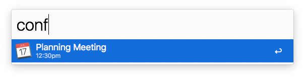

# Open Conference URL

*Copyright 2020-2022 Caleb Evans*  
*Released under the MIT license*

Open Conference URL is an [Alfred][alfred] workflow which enables you to quickly
open links for Zoom and other conferencing services, based on your upcoming
calendar events.

The workflow will be solely supporting Alfred 5 going forward, but the last
release supporting Alfred 4 will remain available here for your convenience.

[alfred]: https://www.alfredapp.com/

## Installation

To download the workflow, simply click the download link below.

[Download Open Conference URL (Alfred 5)][workflow-download-alfred5]

[workflow-download-alfred5]: https://github.com/caleb531/open-conference-url/raw/main/Open%20Conference%20URL%20(Alfred%205).alfredworkflow

[Download Open Conference URL (Alfred 4)][workflow-download-alfred4]

[workflow-download-alfred4]: https://github.com/caleb531/open-conference-url/raw/main/Open%20Conference%20URL%20(Alfred%204).alfredworkflow

### Command Line Tools

If you are installing the workflow for the first time, you may be prompted to
install Apple's Command Line Tools. These developer tools are required
for the workflow to function, and fortunately, they have a much smaller size
footprint than full-blown Xcode.

## Usage

To use, simply type the `conf` command into Alfred, and you will see a list of
upcoming calendar events. It does this by including all events within +/- 20
minutes of your system's current time, so even if you're running late to a
meeting, the logical event will show.

The workflow also accounts for timezones and Daylight Saving Time (DST). All
times are displayed in your system's local timezone.

## Configuration

This workflow contains configuration for various aspects of the workflow's
behavior. For details on how to find these configuration settings, you can refer
to [the Alfred help article on Workflow Configuration][workflow-configuration].

[workflow-configuration]: https://www.alfredapp.com/help/workflows/user-configuration/

### Conference Domains

A comma-separated list of domain names representing which URLs to check within
each calendar event. This domains list determines which links are considered
"conference" URLs.

The domains are listed in order of precedence, so if `zoom.us` precedes
`google.com` in the list, then the workflow will prefer Zoom links over Google
Meet links if both are present in a calendar event.

If you wish to match a subdomain, you must specify it explicitly (e.g.
`teams.microsoft.com`). However, you can also match all subdomains via the
asterisk character (`*`) as a wildcard (e.g. `*.zoom.us`).

### Calendar Names

A comma-separated list of calendar names on your local system for which to fetch
events. If you leave this field blank, then the workflow will implicitly fetch
check all calendars for event data.

### Time Threshold

An integer representing the number of minutes before/after a meeting. If an
event is within this duration of time (relative to the system's current time),
it will be displayed in Alfred's results.

For example, a value of `30` will mean the workflow will only show
events whose start time was within the last 30 minutes *or* whose start time is
within the next 20 minutes.

### Use Direct Zoom Links

Launches meetings directly in the Zoom application, bypassing your web browser
entirely.

### Use Direct Teams Links

Opens Microsoft Teams links directly in the Microsoft Teams application,
bypassing your web browser entirely.

### Time System

Whether 12-hour or 12-hour time are used for the displayed event start times.

## Credits

Kudos to [@jacksonrayhamilton][jrh] for his architecture ideas and feedback on
this project.

[jrh]: https://github.com/jacksonrayhamilton
